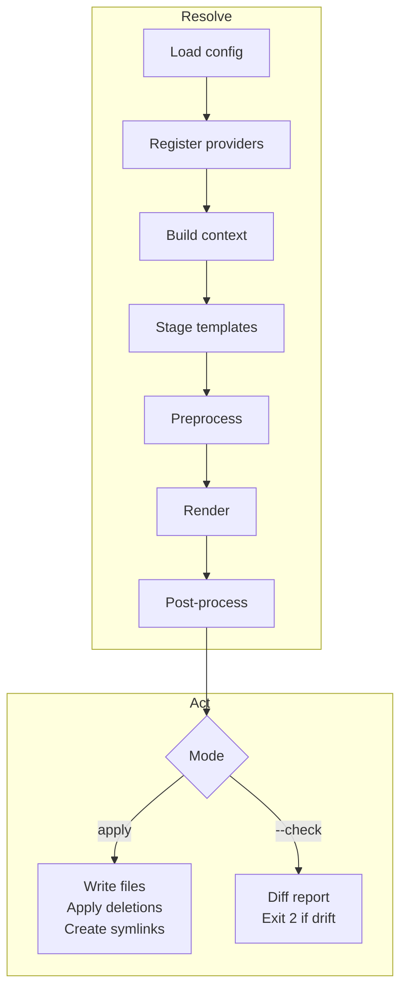

# How Repolish Works

This page walks through the full pipeline from `repolish.yaml` to your project
files. Understanding the flow helps you reason about what repolish will do, why
a diff appeared, and where to look when something is not behaving as expected.

## The two phases

Every repolish run has two phases: **resolve** and **apply** (or **check**).



The resolve phase is read-only: it produces a rendered output tree in
`.repolish/_/render/`. The act phase either writes that tree to your project or
compares it against what is already there.

---

## Load config

Repolish reads `repolish.yaml` (or the path given with `--config`). This file
names the providers to use, sets any context overrides, and specifies
`post_process` commands, `delete_files`, and optionally `paused_files` and
`template_overrides`.

All paths in the config are resolved relative to the directory containing
`repolish.yaml`.

---

## Register providers

Before templates can be loaded, repolish needs to know where each provider lives
on disk. It checks for a pre-existing registration file at
`.repolish/_/provider-info.<alias>.json`.

- If the file exists and the paths it records are still valid, the provider is
  considered ready and nothing else happens.
- If it is missing or stale, repolish runs the provider's CLI (`--info` flag) to
  register it, or writes the registration from `provider_root` if the provider
  is configured locally.

This step is why you need to run `repolish link` (or have link run
automatically) at least once before `apply` can find any templates. After that
the registration file is cached on disk and the step is nearly instant.

---

## Build context

Each provider has a `repolish.py` module that exports a `Provider` class.
Repolish instantiates every provider in order, runs `create_context()` on each
one, then merges the results. Later providers in `providers_order` win when keys
collide.

On top of that merge, any `context` or `context_overrides` you set in
`repolish.yaml` for a given provider are applied. Finally, a set of global
values (`repolish.repo.owner`, `repolish.repo.name`, the current year, etc.) is
available to all templates.

The merged context is what Jinja2 sees when it renders your templates.

---

## Stage templates

Repolish collects each provider's `repolish/` template directory and merges them
into a single staging tree at `.repolish/_/stage/`. When multiple providers ship
the same destination file, the one that appears later in `providers_order` wins
— unless `template_overrides` says otherwise.

Files suppressed with `template_overrides: null` are excluded from staging
entirely and will never reach the render step.

---

## Preprocess (anchor pass)

Before Jinja2 runs, repolish does an anchor-driven preprocessing pass over the
staged templates.

There are two anchor types:

- **Block anchors** (`repolish-start` / `repolish-end`): markers in the provider
  template that get replaced with content from the provider's `create_anchors()`
  method or from the `anchors:` section in `repolish.yaml`. The provider
  controls what goes between the markers — not the user's file.
- **Regex anchors** (`repolish-regex`): a pattern that runs against the
  **current project file** to capture a value (e.g. a version the developer
  already bumped). That captured value replaces the default in the template.

=== "Block anchor — provider template"

    The provider ships a template with a block anchor. The default content
    between the markers is what providers offer out of the box:

    ```makefile
    # install target
    ## repolish-start[install-extras]
    pip install -e ".[dev]"
    ## repolish-end[install-extras]
    ```

=== "Block anchor — provider code"

    The provider's `create_anchors()` method (or `config.anchors`) supplies
    the replacement. The user's file is not read at all for block anchors:

    ```python
    def create_anchors(self, context: Ctx) -> dict[str, str]:
        extras = ",".join(["dev", *context.extra_groups])
        return {
            "install-extras": f'pip install -e ".[{extras}]"',
        }
    ```

=== "After preprocessing"

    The marker lines are stripped and the injected content is locked in before
    Jinja2 runs:

    ```makefile
    # install target
    pip install -e ".[dev,docs,gpu]"
    ```

The regex anchor (`repolish-regex`) works differently — see the
[Anchors](../project-controls/anchors.md) page for the full picture including
regex and multiregex anchors.

---

## Render

Jinja2 renders every file in `.repolish/_/stage/` against the merged context,
writing results to `.repolish/_/render/`. Files that use conditionals, loops, or
Jinja2 expressions are fully evaluated here.

Files with the `.jinja` extension have it stripped from the output name. Files
prefixed with `_repolish.` are conditional — they are only staged if the
provider's file mapping selects them for the current context.

---

## Post-process

If `post_process` commands are configured, repolish runs them now inside the
`.repolish/_/render/` directory. This is where formatters live — running
`ruff --fix .` or `prettier --write .` here ensures the diff and apply steps
always operate on correctly formatted output, so formatting-only changes never
cause spurious diffs.

Commands are run in order. If any exits non-zero, repolish stops immediately.

---

## Check or apply

At this point `.repolish/_/render/` holds the fully rendered, formatted output.
What happens next depends on the mode.

### `repolish apply --check`

Repolish compares each file in the rendered output against its counterpart in
your project and reports:

- **Modified** — provider would change the file
- **New** — provider wants a file that does not exist yet
- **Delete** — provider requested a deletion but the file is still present

If any of these are found, repolish exits with code 2. Clean means exit 0.
`paused_files` are excluded from comparison entirely.

Use `--check` in CI to gate merges on drift. When the check fails, run
`repolish apply` locally, commit the result, and the gate passes.

### `repolish apply`

Repolish writes every file from the rendered output into your project, processes
any `delete_files`, and creates symlinks registered by providers. `paused_files`
are skipped here too.

After apply, `.repolish/_/render/` holds the exact state of what was written,
which is useful for debugging.

---

## Putting it together

Here is a minimal `repolish.yaml` that uses a local provider and a formatter:

```yaml
providers:
  standards:
    provider_root: .local-providers/standards

post_process:
  - ruff --fix .
```

Run the check to see what would change:

```bash
repolish apply --check
```

Apply when you are ready:

```bash
repolish apply
```

From there the [Configuration reference](../provider-development/config-file.md)
covers every field in `repolish.yaml`, and the
[Developer Control](../project-controls/index.md) section shows how to handle
situations where a provider update is not ready for your project yet.
