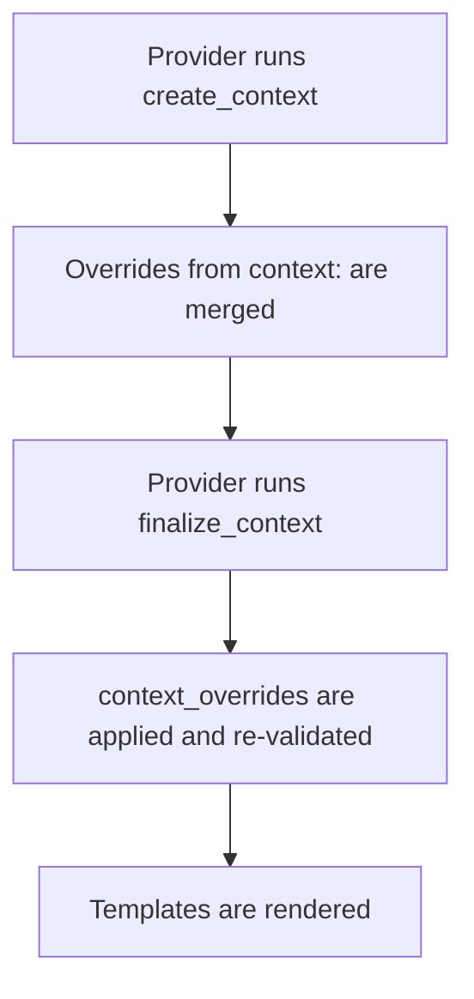

# Override Context

Every provider generates context — the data it uses to render templates (repo
name, owner, language version, feature flags, etc.). If a provider gets a value
wrong for your project, you do not need to fork the provider or wait for a
release. You can patch exactly the values you need directly in `repolish.yaml`.

There are two fields for this: `context` for straightforward value injection,
and `context_overrides` for surgical dot-notation patching deep into a
provider's context model.

## `context` — inject or replace values

Use the `context` field on a provider entry to merge values into that provider's
context after it runs `create_context()`:

```yaml
providers:
  codeguide:
    cli: codeguide-link
    context:
      python_version: '3.12'
      publish_to_pypi: true
```

These values are merged on top of whatever `create_context()` returned. If the
provider already set `python_version`, your value wins.

## `context_overrides` — patch deeply nested values

`context_overrides` uses dot-notation paths to reach values anywhere in a
provider's context object:

```yaml
providers:
  codeguide:
    cli: codeguide-link
    context_overrides:
      codeguide.ci.python_versions: ['3.11', '3.12']
      codeguide.lint.ruff_version: '0.9.0'
```

You can also write it as nested YAML — repolish flattens it automatically:

```yaml
context_overrides:
  codeguide:
    ci:
      python_versions: ['3.11', '3.12']
    lint:
      ruff_version: '0.9.0'
```

Both forms are equivalent.

!!! note `context_overrides` requires the provider to use the class-based
`Provider[Ctx, Inputs]` pattern with typed context fields. It will not work on
older module-level providers that return plain dicts. See
[Provider Migration](../guides/provider-migration.md) if yours is not yet
migrated.

## Merge order

Understanding when your overrides take effect:



`context_overrides` are applied _after_ `finalize_context`, so they cannot be
overridden or ignored by provider logic.

## When a path does not exist

If a dot-notation path does not match any field in the context model, repolish
logs a warning and leaves the context unchanged. The run continues — no error is
raised. Check the logs with `-v` to see which overrides were ignored.

## Validation

After `context_overrides` are applied, the context is re-validated against its
model. If the new value violates the schema (for example, you set an integer
field to a string), repolish logs a warning and keeps the original value.
