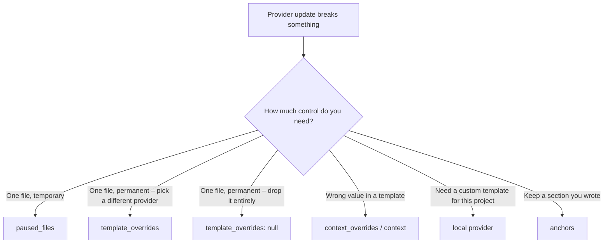

# You Are in Charge

Repolish is a tool that works _for_ you. Providers set the standards, but you
decide when and how they apply to your project. You always have the final word.

This section exists for the moment when a provider ships something unexpected
and you need to keep moving. You should never have to stop working because of
repolish.

## The guarantee

No matter what a provider does, you have at least one way to make repolish leave
a file alone. The options range from a one-line quick fix to a complete local
replacement of an entire provider.

## Your escape hatches



| Escape hatch                                            | What it does                                               | Where to configure                 |
| ------------------------------------------------------- | ---------------------------------------------------------- | ---------------------------------- |
| [`paused_files`](pause.md)                              | Repolish silently skips listed files                       | top-level `repolish.yaml`          |
| [`template_overrides`](template-overrides.md)           | Pin a file to a specific provider, or suppress it entirely | top-level `repolish.yaml`          |
| [`context` / `context_overrides`](context-overrides.md) | Patch the values a provider injects into templates         | per-provider in `repolish.yaml`    |
| [Local provider](local-providers.md)                    | Replace a provider's templates and logic with your own     | `provider_root` in `repolish.yaml` |
| [Anchors](anchors.md)                                   | Mark sections repolish must never overwrite                | markers in your files              |

## Quick reference

If a provider update broke `ci.yml` and you need to ship today:

```yaml
# repolish.yaml
paused_files:
  - .github/workflows/ci.yml
```

That is all. Repolish will not touch that file during `--check` or `apply` until
you remove the entry. Leave a comment so you remember why it is there.

The rest of this section explains each option in detail.
