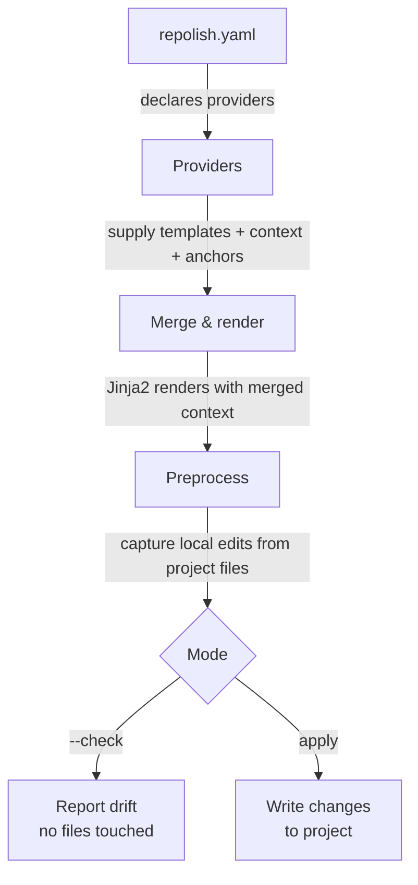

# Repolish

You have ten repositories. They all follow roughly the same structure — similar
CI pipelines, similar tooling config, similar README conventions. One day the
team decides to upgrade the linter version. You update it in one repo, maybe
two. A week later someone opens a PR in a third repo and the old linter fires on
brand-new code. You fix it there too. A month later you find repo seven still
running the original version. This is the slow drift that repolish is built to
stop.

## The idea in one sentence

Repolish lets a team package their repository standards into **providers**, then
push those standards consistently across every project that opts in — without
destroying the local changes that developers have made and own.

## What is a provider?

A provider is a package (or a local directory) that supplies:

- **Templates** — the canonical version of files like `pyproject.toml`,
  `.github/workflows/ci.yml`, or `CONTRIBUTING.md`.
- **Context** — data the templates need to render correctly for a specific
  project (repo name, owner, language version, etc.).
- **Preprocessor directives** — inline markers embedded in templates that
  capture values from your existing project files (versions, config entries,
  pinned tool versions, custom sections) so local state survives every apply.

Without providers there is nothing to apply. Repolish itself is the engine;
providers are the content. Your team writes one or more providers and every repo
that includes them in its `repolish.yaml` gets the same standards applied
automatically.

## How it flows



Run `repolish --check` in CI to catch drift before it merges. Run
`repolish apply` locally (or in an automated PR) to pull in updates from
providers.

## You are always in control

Repolish is a tool that works _for_ you, not against you. If a provider ships a
broken template, or introduces a change you are not ready to absorb right now,
you never have to stop working. Add the affected file to `paused_files` in your
`repolish.yaml` and repolish will silently skip it until you remove it:

```yaml
paused_files:
  - .github/workflows/ci.yml # provider update pending, resume after v2.3
```

That is the quick escape hatch. The
[Developer Control](project-controls/index.md) section documents every tool
available to you: pausing files, overriding templates, patching context, and
running a fully local provider when you need total independence from upstream.

## Where to go next

- [Installation](getting-started/installation.md) — get repolish installed
- [Quick Start](getting-started/quick-start.md) — run your first check and apply
- [Tutorial](tutorial/index.md) — build two providers from scratch and discover
  why each feature exists
- [How It Works](concepts/overview.md) — deeper look at the pipeline
- [Developer Control](project-controls/index.md) — all your escape hatches

## Working with an AI assistant

If you are using an AI coding assistant to help configure or extend repolish,
point it at the [AI Agent Reference](llms.md) page first. That single page gives
the assistant a complete map of what repolish does, how the config file is
structured, and where to look for deeper detail — so it can help you without
guessing.
