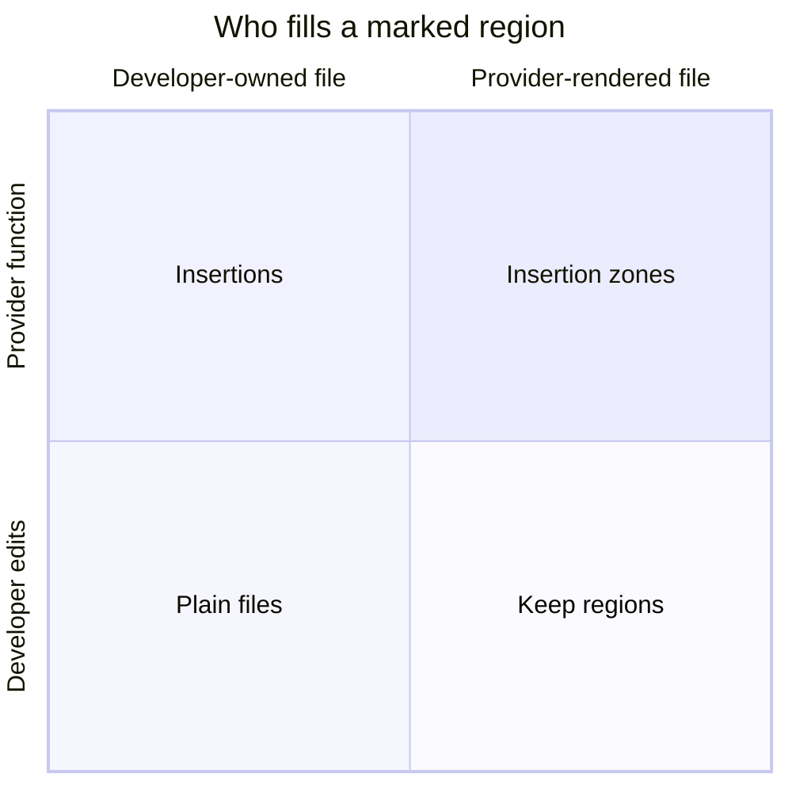

# Markers

Markers are the lines you (or a provider template) place inside a document to
tell repolish how each marked region should behave. There are two families:

- **Directives** — `repolish-*` markers in *template files*, processed around
  rendering.
- **Insertions** — `repolish:on/off`, marker blocks in your own files, filled
  by provider functions after files are written.

## The four quadrants

Every marked region answers two questions: **where does the file live**, and
**who fills the region**?

- **Plain files** (no marker needed) — you own the file and you edit it;
  repolish leaves everything alone.
- **Keep regions** — `repolish-keep-block` / `-rest` / `-header`: repolish
  regenerates the file from a template, but marked regions come from *your*
  current version.
- **Insertions** — `repolish:on/off`: you own the file, but marked regions are
  filled by provider functions.
- **Insertion zones** — `repolish-insert` (planned): the template declares the
  region *and* the provider fills it. The fourth quadrant completes the
  pattern.

The **Directives** pages in this tab cover the template side — tag blocks,
keep regions, regex and multiregex — and **Insertions** covers the
function-filled blocks in developer-owned files.

<!-- Usage examples to be drawn from: tests/directives/, tests/insertions/, tests/integration/test_directives_after_render.py -->
