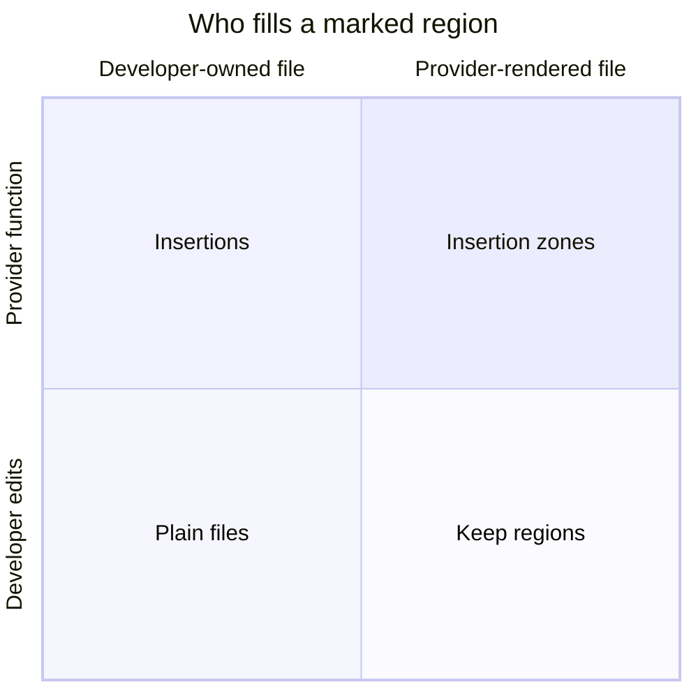

# Markers

Markers are the lines you (or a provider template) place inside a document to
tell repolish how each marked region should behave. There are two families:

- **Directives** — `repolish-*` markers in _template files_, processed around
  rendering.
- **Insertions** — `repolish:on/off`, marker blocks in your own files, filled by
  provider functions after files are written.

## The four quadrants

Every marked region answers two questions: **where does the file live**, and
**who fills the region**?

- **Plain files** (no marker needed) — you own the file and you edit it;
  repolish leaves everything alone.
- **Keep regions** — `repolish-keep-block` / `-rest` / `-header`: repolish
  regenerates the file from a template, but marked regions come from _your_
  current version.
- **Insertions** — `repolish:on/off`: you own the file, but marked regions are
  filled by provider functions.
- **Insertion zones** — `repolish-insert` (planned): the template declares the
  region _and_ the provider fills it. The fourth quadrant completes the pattern.

The **Directives** pages in this tab cover the template side — tag blocks, keep
regions, regex and multiregex — and **Insertions** covers the function-filled
blocks in developer-owned files.

## Markers at a glance

| Marker                                              | What it's for                                                               | `after-render`                               | Status    |
| --------------------------------------------------- | --------------------------------------------------------------------------- | -------------------------------------------- | --------- |
| `repolish-start` / `repolish-end`                   | Tag blocks — provider fills a region (`create_anchors()` / `repolish.yaml`) | No — anchor content must exist before Jinja2 | Available |
| `repolish-keep-block`                               | Preserve a bounded region from your current file                            | Yes                                          | Available |
| `repolish-keep-rest`                                | Preserve everything from a marker to end of file                            | Yes                                          | Available |
| `repolish-keep-header`                              | Preserve the top of the file up to a marker                                 | Yes                                          | Available |
| `repolish-regex`                                    | Adopt a single value or line by pattern                                     | Yes                                          | Available |
| `repolish-multiregex-block` / `repolish-multiregex` | Merge a structured section (e.g. `key = "value"` lines) keeping your values | Yes                                          | Available |
| `repolish:on` / `repolish:off`                      | Insertions — provider function fills blocks in _your own_ files             | n/a — insertions already run after rendering | Available |
| `repolish-insert`                                   | Insertion zones — provider declares a fillable zone in the template         | n/a — filled by the insertion phase          | Planned   |

<!-- insertion-candidate: the after-render and status columns mirror the directive registry (repolish/directives/registry.py) plus the planned insert-zones family — could be generated once directives self-document -->

## What markers don't cover (yet)

Known gaps, tracked as future work rather than documented behavior:

- **Insertion zones** — the fourth quadrant (`repolish-insert`): a provider
  declares a fillable zone in a template, the insertion phase fills it once the
  file is on disk. Planned.
- **Repeated regex / multiregex occurrences** — regex and multiregex apply is
  _single-occurrence_: with loop-generated duplicates, only the first rendered
  occurrence is reconciled against your file; the rest keep template defaults.
  Keep directives already solve this (`end-regex` + first-to-first occurrence
  pairing); extending the same pairing to regex/multiregex is the follow-up.
- **Multiregex directive lines in unmatched blocks** — when the block pattern
  finds nothing in your current file, its directive lines survive into the
  output instead of being stripped; this includes fresh projects with no local
  file at all. Quirk, not design (preview-verified).

<!-- Usage examples to be drawn from: tests/directives/, tests/insertions/, tests/integration/test_directives_after_render.py -->
